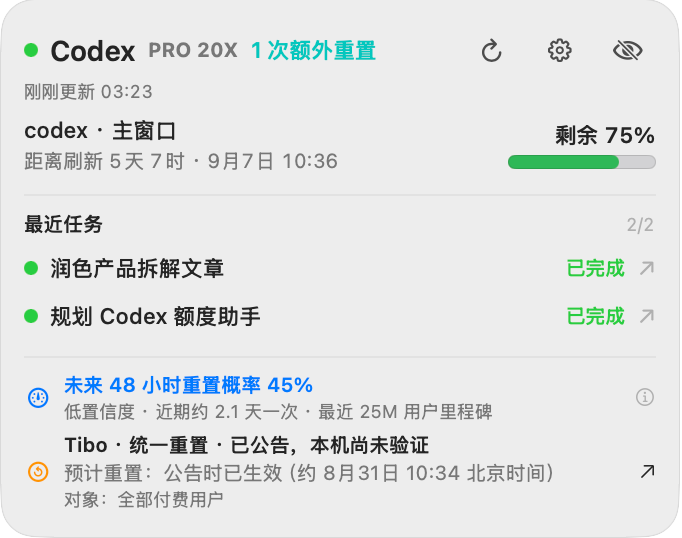
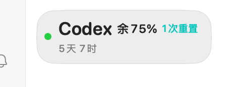
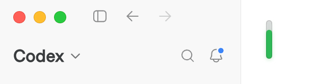
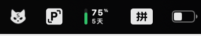
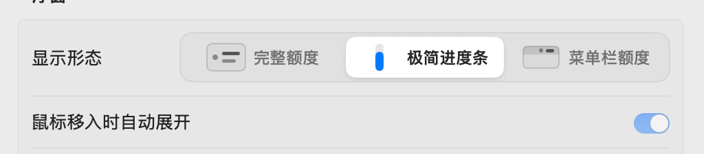

# Codex Float

Codex Float 是一个 macOS 14+ 原生浮窗助手。它默认只在 ChatGPT/Codex 位于前台时显示本机 Codex 额度、重置时间和额外 Reset，并通过 Twiscan/Twitee 追踪 Tibo（[@thsottiaux](https://x.com/thsottiaux)）的额度活动；设置中也可允许它覆盖其他应用。

当前版本正在按公开测试版标准准备：只读，不会消耗 Reset，也不会读取 `auth.json`、聊天正文、rollout 或浏览器 Cookie。Codex Float 是独立社区项目，与 OpenAI 或 X 无隶属、授权或背书关系。

## 界面预览

<p align="center">
  
</p>

<p align="center"><sub>悬停展开的完整浮层：额度、最近任务、未来 48 小时重置概率与 Tibo 重置公告集中展示。</sub></p>

| 完整额度 | 极简进度条 | 菜单栏额度 |
|:---:|:---:|:---:|
|  |  |  |
| 显示剩余百分比、刷新倒计时与额外 Reset | 只保留颜色和长度可感知的额度进度 | 真正的系统状态栏项目，悬停展开完整内容 |

<p align="center">
  
</p>

<p align="center"><sub>三种形态可随时在设置中切换，并分别记住用户调整后的位置。</sub></p>

## 已实现

- 原生 `NSPanel + SwiftUI` 浮窗支持三种显示形态：`174×54` 完整额度条、`36×54` 热区内的竖向极简进度条，以及用竖向额度、百分比和倒计时组成的原生 macOS 菜单栏额度。前两种形态悬停后展开为 `340px` 宽的完整浮窗；菜单栏形态悬停后在状态项下方打开完整内容。
- 普通与极简进度条会随剩余额度缩短，并按正常、偏低、即将用尽显示绿色、黄色、红色；进入阈值前会先逐步混色，长度与颜色均使用缓动过渡。
- “仅 ChatGPT / Codex 在前台时显示”默认开启：切到其他应用会自动隐藏，返回后自动恢复；手动隐藏优先，不会因切回而擅自恢复。该设置可关闭。
- 所有 Spaces、全屏辅助窗口、多显示器；按屏幕保存归一化位置，拔掉显示器后自动回到可见区域。
- 菜单栏额度形态使用真正的系统状态栏项目：悬停查看完整内容，右键打开操作菜单；百分比和刷新倒计时会持续更新，可按住 Command 拖到刘海附近，位置由 macOS 保存。
- 当 macOS 因菜单栏拥挤隐藏入口时，在任意应用中按全局快捷键即可显示或隐藏浮窗，无需辅助功能权限。默认为 `⌃⌥C`（Control–Option–C），可在设置中直接录制新组合、关闭或恢复默认。
- 浮窗齿轮和菜单栏右键均可打开设置；可调整悬停折叠延时、启动时是否显示、任务数量、通知阈值与活动雷达。
- 展开态额度条使用不受窗口焦点影响的自绘颜色：绿色为健康剩余额度，黄色为低额度，红色为紧急额度，灰色底轨代表总量中已经消耗的部分；折叠态不显示横向进度条，只在 `Codex` 旁直接显示剩余百分比。
- 展开后默认显示最近 3 个 Codex 任务，可在设置中调整为 1–8 个，浮窗会为选中的任务数量自适应增加高度。绿色表示已完成/空闲，黄色表示正在执行，红色表示最近回合失败；点击任务可直接进入对应 Codex 聊天。
- 任务工作中每 2 秒只读查询 Codex `thread_history_*.sqlite` 的 `thread_turns` 状态字段，并每 10 秒校准任务摘要；全部空闲时降为每 15 秒一次完整校准。只读取任务 ID、回合 ID、状态与时间戳，不查询消息表、聊天正文或 rollout。正常启动不会读取或修改 `~/.codex/hooks.json`；早期版本遗留的 Hook 命令只返回空结果，用户可自行从 Codex 配置中删除。
- 独立活动记录窗口展示最近 100 条分类结果、原文、受众、证据、置信度和账号验证状态。
- 独立额度详情窗口展示所有动态窗口、已用/剩余、绝对重置时间、套餐、余额、限制状态，以及 Reset 的标题、说明和过期时间。
- 持久 `codex app-server` JSON-RPC 连接，只调用 `account/rateLimits/read` 与只读 `thread/list`。
- 动态读取所有 `rateLimitsByLimitId` 窗口，不假设只有五小时或每周窗口。
- 界面默认只显示标准 Codex 额度；`GPT-5.3-Codex-Spark` 主/次窗口和 `gpt-reserve` 默认隐藏，可在设置中开启。
- 监听 `account/rateLimits/updated` 实时刷新；默认每 30 秒兜底校准，可在设置中改为 15 秒、30 秒、1 分钟或 5 分钟。失败后每 10 秒重试并重启失去响应的 App Server，唤醒、网络恢复和重新显示时也会立即刷新。
- 失败时保留最后成功快照并明确标记陈旧/离线，不把错误显示成 0%。
- 显示剩余/已用、倒计时、绝对重置时间、套餐、限制状态和额外 Reset。
- Twiscan 首选、Twitee 备用；无 Cookie、无磁盘网页缓存，失败按 5/15/30 分钟退避。
- 纯规则七分类、中文摘要、触发证据、置信度和账号观察验证。
- Tibo 浮窗和活动记录只展示 Reset 相关公告，同时标出预计重置时间或“待确认”；额度规则讨论、故障和其他无关帖子不展示。
- Tibo 区域可显示“未来 48 小时重置概率”：采用公开近期事件率预测，同时展示近期节奏、Tibo 直接信号、数据新鲜度与用户里程碑投影。预测超过 6 小时会停止报数；“每增加 100 万用户就重置”的历史承诺只到 1000 万，之后的增长数据仅作背景证据，不会被包装成必然重置。
- SQLite 仅保留 288 个额度快照、100 条规范化帖子、24 份重置预测快照、最近任务摘要与最多 1000 条、90 天内的通知去重键；不保存聊天正文、原始网页或媒体。
- 20%/5% 可调额度提醒、新 Reset、48 小时内过期、新 Tibo Reset 消息、固定重置窗口刷新前 5 小时通知，以及 Codex 任务完成通知。滚动窗口不会伪装成固定刷新时间；同一固定周期只提醒一次。关闭系统通知或“刷新前 5 小时提醒”时会立即取消尚未触发的定时提醒。
- Tibo 新重置公告会以薄荷色气泡说明适用对象和预计重置时间；额度跨过“偏低/即将用尽”阈值时分别显示橙色呼吸或红色脉冲反馈。完整、极简和菜单栏三种形态都会处理，提示结束后自动恢复；设置中的“预览反馈动效”可随时测试三类反馈。
- 脱敏诊断不包含账号标识、凭证、帖子正文或 Codex 内容。

## 运行

需要 macOS 14+、Swift 6 工具链，以及已安装并登录的 ChatGPT/Codex。程序按顺序查找：

1. `/Applications/ChatGPT.app/Contents/Resources/codex`
2. `~/Applications/ChatGPT.app/Contents/Resources/codex`
3. Homebrew 常见路径
4. 当前 `PATH` 中的 `codex`

开发运行：

```bash
swift run CodexFloat
```

构建可双击的本地签名应用：

```bash
./Scripts/build-app.sh
open dist/CodexFloat.app
```

构建 Universal 2 本地应用：

```bash
CODEX_FLOAT_UNIVERSAL=1 ./Scripts/build-app.sh
```

图标由仓库内的 SVG 源文件确定性生成。修改源图后可运行：

```bash
./Scripts/generate-icon.sh
```

配置 Developer ID 与 `notarytool` 钥匙串 Profile 后构建、公证正式 DMG。版本号、构建号和正式 Bundle ID 均可由环境变量注入：

```bash
CODEX_FLOAT_VERSION="0.1.0" \
CODEX_FLOAT_BUILD_NUMBER="1" \
CODEX_FLOAT_BUNDLE_ID="com.example.codexfloat" \
CODEX_FLOAT_SIGNING_IDENTITY="Developer ID Application: Example (TEAMID)" \
CODEX_FLOAT_NOTARY_PROFILE="codexfloat-notary" \
./Scripts/release-app.sh
```

发布脚本会生成已公证 DMG 与 SHA-256 校验文件。首次启用通知时 macOS 会请求通知权限。本地构建默认使用 ad-hoc 签名；正式发布仍需要维护者自己的 Apple Developer 账号、Developer ID 证书和公证凭据。

## GitHub 发布准备

- `.github/workflows/ci.yml` 会在 push 与 pull request 上运行普通测试、Address Sanitizer、警告即错误的 Release 编译，并校验 Universal 2 应用、签名结构和图标。
- `.github/workflows/release.yml` 会在 `v*` 标签或手动触发时导入临时签名钥匙串，构建 Universal 2 应用、公证 DMG、生成校验值与构建来源证明，再创建 GitHub Release。
- 在 GitHub 的 `release` Environment 中配置 `APPLE_CERTIFICATE_P12_BASE64`、`APPLE_CERTIFICATE_PASSWORD`、`APPLE_KEYCHAIN_PASSWORD`、`APPLE_SIGNING_IDENTITY`、`APPLE_API_KEY_P8_BASE64`、`APPLE_API_KEY_ID`、`APPLE_API_ISSUER_ID`；将正式包名配置为 Environment variable `CODEX_FLOAT_BUNDLE_ID`。
- 公开仓库已包含安全报告入口、隐私说明、贡献规范、Bug 模板和 Dependabot 的 Actions 月度检查。

## 测试

```bash
swift test
swift test --sanitize=address
swift test --sanitize=thread
swift build -c release -Xswiftc -warnings-as-errors
CODEX_FLOAT_LIVE_TEST=1 swift test --filter currentCodexAppServerAndFeed
```

普通测试完全使用固定样本。Live 测试会读取当前登录账号的真实额度、最近任务摘要与状态字段，并访问当前首选帖子镜像；它只断言数据可读，不记录额度值、任务内容或账号信息。

## 目录

- `Sources/CodexQuotaCore`：CLI 定位、App Server 生命周期、JSON-RPC、动态额度与任务摘要归一化。
- `Sources/TiboFeedCore`：双镜像适配、HTML 解析、去重与退避。
- `Sources/ActivityClassifier`：规则分类与账号变化关联。
- `Sources/LocalStore`：独立 SQLite 缓存、只读任务状态索引和通知去重。
- `Sources/CodexFloat`：浮窗、菜单栏、设置、任务状态同步、通知、网络与诊断。
- `Tests/CodexFloatTests`：协议、解析、误报、关联与存储测试。

## 明确未实现

安全换机 `.codexpack` 属于第二阶段。MVP 不扫描会话、Skills、Memories、插件或自动化目录，也不包含任何导入/覆盖逻辑。

## 数据源说明

Twiscan 与 Twitee 是第三方公开网页镜像；重置概率与里程碑历史来自 `codex-reset.com` 的公开非官方 API。这些来源可能随时改版、限流或停止服务。应用会明确显示“来源不可用”，不会把抓取失败解释成“没有新帖子”，也不会用过期预测继续报数。公开发布前需要重新复核服务条款和稳定性；设置中可以关闭活动雷达或只关闭概率。

协议实现以 [OpenAI Codex App Server](https://github.com/openai/codex/tree/main/codex-rs/app-server) 的公开协议为准；项目结构和兼容性思路参考了 MIT 许可的 [codex-limits](https://github.com/thrr87/codex-limits) 与 [CodexBar](https://github.com/steipete/CodexBar)，本仓库不捆绑这些项目的源码或素材。
