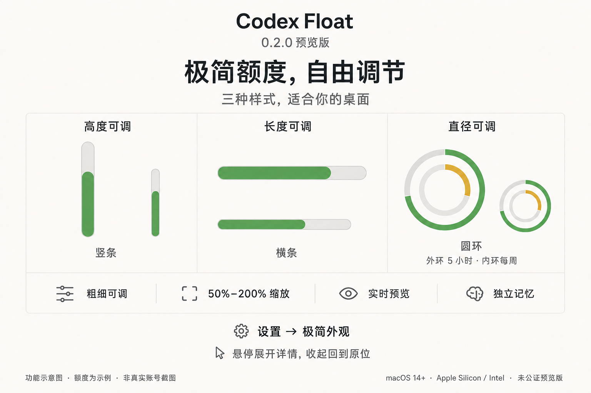

# AI Max · GitHub 日常发布视觉规范

状态：用户于 2026-09-03 确认，将 Codex Float 0.2.0 的介绍图作为后续 GitHub 日常发布的默认视觉方向。

风格名称：**浅色原生图解 / Quiet Native**。这是用户的发布偏好，不是 GitHub 或 OpenAI 的官方视觉规范。它适用于项目介绍、功能说明、Release 配图与操作指南；不要擅自重绘项目 Logo 或改变已有品牌。

## 视觉锚点

新图首先对齐这张图的气质与层级，而不是重新探索风格：暖白底、石墨黑标题、细灰线、克制的绿与黄、平面化的产品图解。可以改变构图，不必每张都套三个栏目。

## 固定规则

| 项目 | 默认规则 |
| --- | --- |
| 画幅 | 横版 3:2，推荐 1536×1024 PNG；四边至少 64px 安全区。其他比例只在发布位确实需要时另做，不拉伸原图。 |
| 背景 | 暖白，建议 `#FAF9F6`；主体可以使用略深的中性灰底。 |
| 文字 | 主标题石墨黑 `#202527`；正文 `#555B5E`；次要信息 `#73787B`。使用清晰的无衬线中文黑体，参考苹方 / 思源黑体。 |
| 强调色 | 默认使用柔和绿 `#60A05A`。警示用琥珀黄 `#D5AA39`，错误才用红。一个画面通常不超过两种强调色；产品已有的语义色优先，不为统一风格改变数据含义。 |
| 线与形 | 灰色底轨、轻边框、细分隔线、适量圆角；不用粗框包围所有内容，不堆卡片。 |
| 层级 | 小号项目名 / 类别 → 一句大标题 → 一句解释 → 一个主要图解 → 2–4 个能力点 → 必要说明。 |
| 文案 | 简体中文优先，短句、直白；保留真实项目名与必要英文术语。不要把完整更新日志挤进图里。 |
| 图示 | 让用户看懂功能或操作，不以装饰代替信息。单图解决一个主题；不同样式必须让人知道是可选项，不暗示同时出现。 |
| 品牌 | 只使用真实项目名；没有授权不要加入第三方 Logo、官方认证、背书或赞助标记。 |

以上色值是可复用的设计目标，不代表生成图片每个像素都精确等于该值。若需要严格的数值图、精确界面或品牌资产，优先使用真实导出和可复现排版，并标清来源。

## 三种常用版式

1. **发版首图**：项目名 + 版本 + 本次核心收益，主体只选最重要的 1–3 个变化。版本、支持平台、预览 / 公证状态必须真实。
2. **功能图解**：不写版本号，保持长期可用。用一幅清晰主体或两三项并列解释一个功能；入口与限制写在图下。
3. **操作 / 对照图**：步骤或前后状态有明确对应；最多 3 步。状态色、箭头与说明必须表达真实行为，不能把“悬停”画成“点击”。

## 不做什么

- 不用霓虹渐变、玻璃炫光、强透视、厚阴影、拟物 3D 和装饰性仪表盘。
- 不编造用户量、性能数据、评价、套餐权益、发布时间或功能。
- 不将生成的界面写成“真实截图”；不把示例额度、示例任务、预测当成真实账号状态或承诺。
- 不把概率画成确定的重置公告，不把生成的进度长度与文字百分比画成两套数据。
- 不为了统一风格删掉免责声明、已知限制和安装风险。
- 不覆盖历史版本的安装包、签名、校验值或代码标签。只改宣传内容时，记录为文档 / 视觉更新。

## 发布前检查

- [ ] 对照当前源码 / 已发布功能核实图内每一句话，未完成的功能不放进图。
- [ ] 所有中文、数字、单位与百分比逐项可读；圆环与进度条比例能对上。
- [ ] 没有裁切、遮挡、错位、漂浮的图标和跨越主体的引线。
- [ ] 在原始尺寸与约 760px 的 README 阅读尺寸都检查一次；重要说明不依赖微小字号。
- [ ] 图内带“功能示意图 / 数据为示例”等必要标记，原生截图另留核对入口。
- [ ] 保存成品、提示词、来源、文件清单和 SHA-256；图片进入仓库，不只留在临时路径。
- [ ] 更新 README / Release 的图片与 alt 文本，实查远端链接；新增附件重新下载核对校验值。

## 后续怎么复用

默认使用本规范和 [提示词模板](prompt-template.md)。新任务只替换项目名、功能事实、文案与主体图示，继续引用本页的视觉锚点；用户没有要求换风格时，不重新做风格投票。

本轮六张成品、原始截图映射和生成记录见 [图库](gallery.md)。此规范可复制到其他 GitHub 项目，但不自动授权向其他仓库发布内容。
