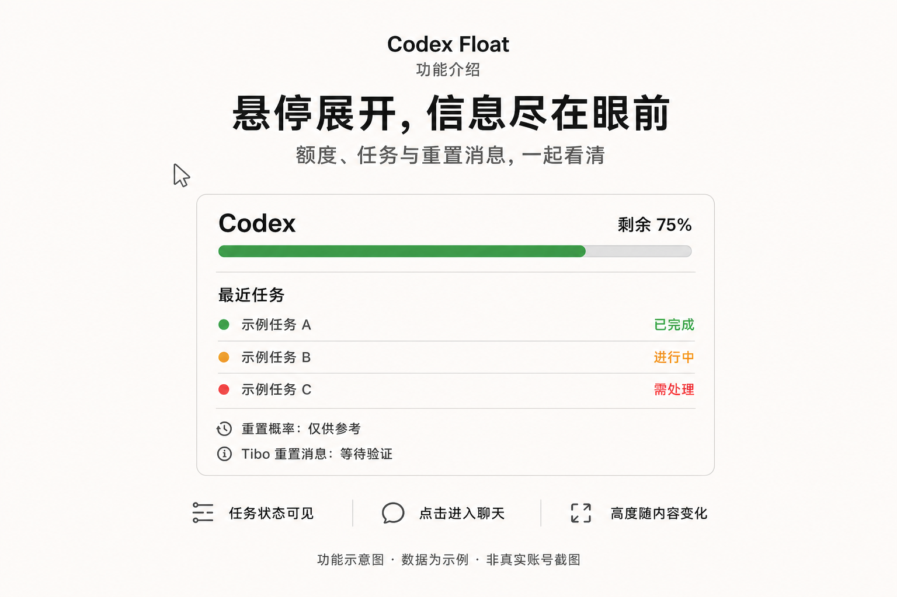
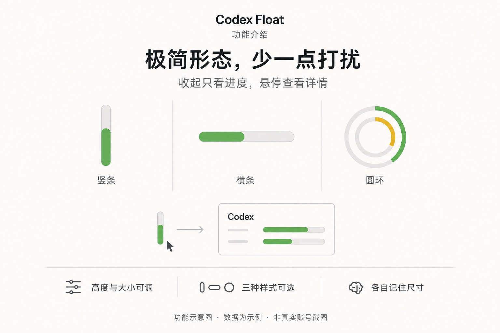
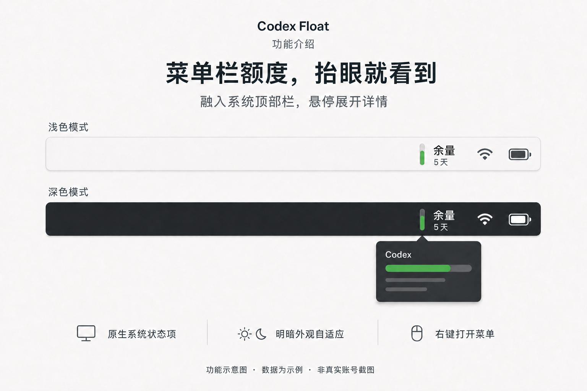
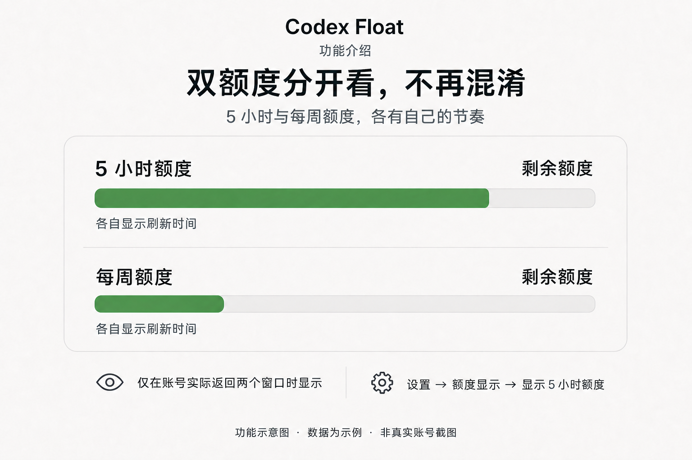

# Codex Float · 浅色原生图解

2026-09-03 视觉更新。以下六张为重新制作的功能示意图，沿用用户确认的 0.2.0 发布图风格。数据与任务均为示例，不是真实账号截图；原始资料仍保留，不因重绘而改变历史软件功能。

## 悬停展开

重置概率仅供参考；Tibo 的公告与本机账号已观察到的变化必须区分。任务行可进入对应聊天。[原始界面资料](../Images/codex-float-expanded.png)。

## 完整额度

收起时不额外显示横向进度条；悬停查看详情。[原始界面资料](../Images/codex-float-compact.png)。

## 极简形态

这是三个可选样式，不是三个组件同时出现。横条与圆环在 0.2.0 新增，旧版极简组件为竖条。[原始界面资料](../Images/codex-float-minimal.png)。

## 菜单栏额度

额度属于系统状态栏区域，不覆盖左侧应用菜单。图中“余量”是概念标识，实际应用显示百分比。实际位置由 macOS 管理，可按住 Command 拖动；不是强制固定在刘海左侧。[原始界面资料](../Images/codex-float-menu-bar.png)。

## 显示设置

支持简体中文、繁体中文与英语，全局快捷键可在设置中编辑。[原始界面资料](../Images/codex-float-display-settings.png)。

## 双额度

仅当账号实际返回对应窗口时显示；不由图片推断 Free、Plus 或 Pro 的固定权益。条形只说明两个窗口独立变化，不表达具体账号数值。[原生固定测试样本](../Images/codex-float-quota-windows.png)。

## 制作记录

- [视觉规范](README.md) / [后续提示词模板](prompt-template.md)
- [展开与完整额度提示词](prompts-overview-compact.md)
- [极简与菜单栏提示词](prompts-minimal-menubar.md)
- [设置与双额度提示词](prompts-settings-dual.md)
- [文件清单与校验值](manifest.json)

图像通过内置 ImageGen 生成，并逐张检查文字、数据含义、构图与裁切。生成示意不替代原生 UI 回归测试。此次仅更新介绍材料，不改变 0.2.0 的代码标签、DMG、ZIP 或其原有校验值。
